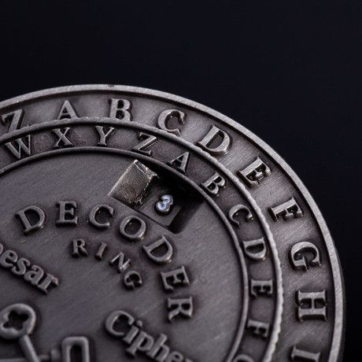

<div align="center">
    <h1>Crypto Analyzer App</h1>
    
</div>

## <h2>Crypto Analyzer App </h2>

<h3>The program operates in several modes: </h3>
<ol> 
<li>Text Ecryption using a Caesar cipher. </li>
<p></p>
The Caesar cipher is a substitution cipher. Each character in the text is replaced by a character that is located at some constant positions number (key) to the right of it in the alphabet.
<p></p>   
Example: "Hello world", Key = 1;  Result = "Ifmmp xpsme"  
<p></p>   
<li>Text Decipherment using a Caesar cipher. </li>
<p></p>
Using the known key, the ciphertext is decrypted using the Caesar cipher.
<p></p>
Example: "Ifmmp xpsm", Key = 1;  Result = "Hello world"
<p></p>   
<li>Text Decipherment using Brute-force searching. </li>
<p></p>
There is a search of all keys. The decoder decrypts the text based on the metric of the most frequently used words.
<p></p>
Example: After going through all the keys, the decoder analyzed that with the key 11 in the text, words like "they", "are", "am", "an" occured most often. Therefore, 11 is the key you are looking for. The decryptor then decrypts the text using key 11.
<p></p> 
<li> Text Decipherment using method of frequency statistical analysis method. </li>
<p></p>
Frequency analysis assumes that the frequency of occurrence of a given letter of the alphabet in sufficiently long texts is the same for different texts of the same language. If there is a symbol in the ciphertext with a similar probability of occurrence, then we can assume that it is the specified encrypted letter.
<p></p>    
Example:
In the encrypted text, the letter "c" is found most often. After analyzing the text of another work by the same author, the decoder calculated that the letter "e" is more common in this text. Accordingly, it changes "c" to "e".   
<p></p>
</ol>    
Created by Konovalov Vadim, Belousov Vladimir, Lev Nagornov.

## Table of Contents

- [Install](#install)
- [Usage](#usage)
- [Maintainers](#maintainers)
- [Contributing](#contributing)
- [License](#license)
- 
## Install

1. Clone the repository using:

```
git clone https://github.com/Onemyname/CryptoAnalyzer.git
```

2. Open using your favorite IDE, we recommend either: 
* [IntelliJ IDEA](https://www.jetbrains.com/idea/)


## Usage

1. Open up a terminal.

2. Go to the project folder:
```
cd "path of project"
```
2. Compile the program
 ```
javac -Runner.java
``` 
3. Run the program
```
java -Runner.java
```  
3. Follow the steps on the included User Manual in the repository.

## Maintainers

[@Onemyname](https://github.com/Onemyname)
[@lnagornov](https://github.com/lnagornov)
[@vladimirbelousovk](https://github.com/vladimirbelousovk)

## Contributing

PRs accepted.

## License

[MIT © Vadim Konovalov](LICENSE.txt)
